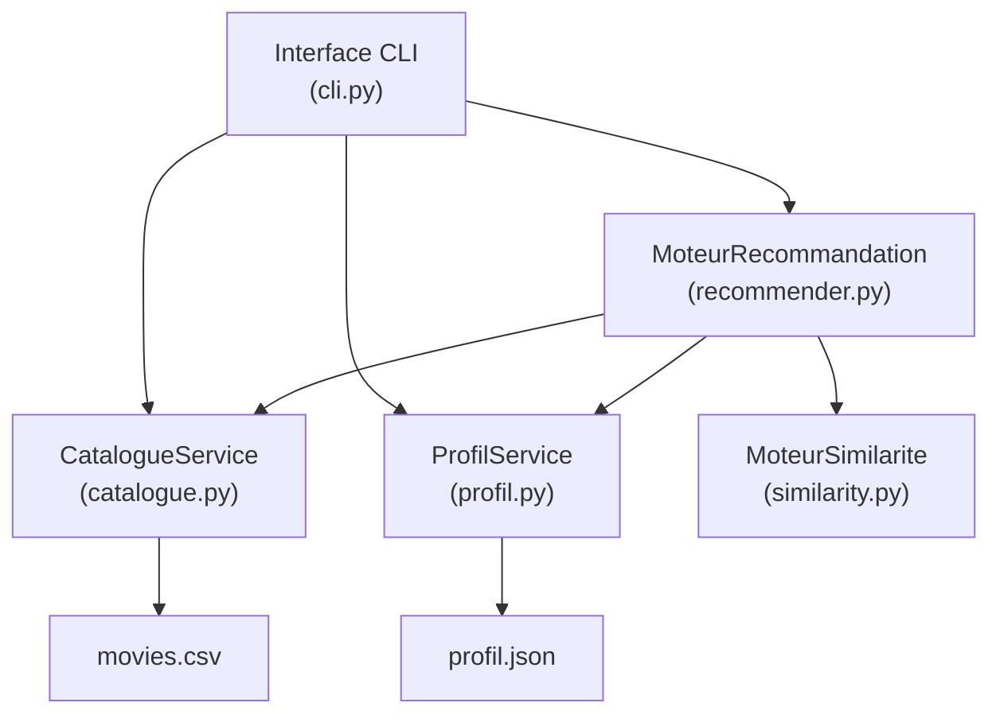

# Document de Design — Système de Recommandation de Films

## Vue d'ensemble

Le système de recommandation de films est une application CLI en Python qui charge un catalogue de films depuis un fichier CSV, permet à l'utilisateur de sélectionner ses films préférés, calcule des scores de similarité entre films, et génère une liste de recommandations personnalisées. Le profil utilisateur est persisté en JSON pour être réutilisé entre les sessions.

L'algorithme de similarité combine deux signaux :
- **Similarité de genres** : coefficient de Jaccard entre les ensembles de genres de deux films.
- **Similarité textuelle (optionnelle)** : similarité cosinus sur les vecteurs TF-IDF des descriptions.

Le score final est une moyenne pondérée des deux signaux (poids configurables).

---

## Architecture



Le flux principal est le suivant :

1. Au démarrage, `CatalogueService` charge et valide `movies.csv`.
2. `ProfilService` tente de charger `profil.json` (ou initialise un profil vide).
3. L'interface CLI présente le catalogue et permet la sélection interactive.
4. À la demande, `MoteurRecommandation` délègue le calcul à `MoteurSimilarite` et retourne le top-10.
5. Le profil est sauvegardé via `ProfilService`.

---

## Composants et Interfaces

### CatalogueService

Responsable du chargement, de la validation et de l'exposition du catalogue.

```python
class CatalogueService:
    def load(self, path: str) -> list[Film]: ...
    # Lève FileNotFoundError si le fichier est absent
    # Ignore les lignes malformées et journalise un avertissement
    # Retourne la liste triée par id croissant

    def get_all(self) -> list[Film]: ...
```

### ProfilService

Responsable de la gestion du profil utilisateur (sélection, désélection, persistance).

```python
class ProfilService:
    def load(self, path: str) -> None: ...
    # Initialise un profil vide si le fichier est absent
    # Ignore les ids absents du catalogue et journalise un avertissement

    def save(self, path: str) -> None: ...
    # Sérialise en JSON, écrase le fichier existant

    def add(self, film_id: int) -> None: ...
    # Ignore si déjà présent ; lève ValueError si limite de 10 atteinte

    def remove(self, film_id: int) -> None: ...

    def get_films(self) -> list[Film]: ...
```

### MoteurSimilarite

Calcule le score de similarité entre deux films.

```python
class MoteurSimilarite:
    def __init__(self, use_tfidf: bool = False, genre_weight: float = 0.5): ...

    def fit(self, films: list[Film]) -> None: ...
    # Construit la matrice TF-IDF si use_tfidf=True

    def score(self, film_a: Film, film_b: Film) -> float: ...
    # Retourne un float dans [0.0, 1.0]
    # Symétrique : score(a, b) == score(b, a)
    # score(a, a) == 1.0
```

Calcul du score :

```
score(a, b) = genre_weight * jaccard(genres_a, genres_b)
            + (1 - genre_weight) * cosine_tfidf(desc_a, desc_b)   # si use_tfidf
```

Sans TF-IDF : `score(a, b) = jaccard(genres_a, genres_b)`

### MoteurRecommandation

Agrège les scores et produit le top-10.

```python
class MoteurRecommandation:
    def recommend(self, profil: list[Film], catalogue: list[Film]) -> list[Recommandation]: ...
    # Exclut les films du profil
    # Score d'un candidat = moyenne des scores vis-à-vis de chaque film du profil
    # Trie par score décroissant, retourne au maximum 10 résultats
    # Score arrondi à 2 décimales
```

### Interface CLI (`cli.py`)

Point d'entrée principal. Gère la boucle interactive :
- Affichage du catalogue
- Sélection / désélection de films
- Lancement du calcul de recommandations
- Affichage des résultats
- Sauvegarde du profil
- Option pour démarrer une nouvelle session sans redémarrer

---

## Modèles de Données

### Film

```python
@dataclass
class Film:
    id: int
    title: str
    genres: list[str]   # ex. ["Action", "Sci-Fi"]
    description: str
```

### Recommandation

```python
@dataclass
class Recommandation:
    film: Film
    score: float        # arrondi à 2 décimales, dans [0.0, 1.0]
```

### ProfilUtilisateur (sérialisation JSON)

```json
{
  "film_ids": [1, 4, 7]
}
```

### Structure de fichiers du projet

```
movie-recommender/
├── data/
│   └── movies.csv
├── src/
│   ├── models.py          # Film, Recommandation
│   ├── catalogue.py       # CatalogueService
│   ├── profil.py          # ProfilService
│   ├── similarity.py      # MoteurSimilarite
│   ├── recommender.py     # MoteurRecommandation
│   └── cli.py             # Point d'entrée CLI
├── tests/
│   ├── test_catalogue.py
│   ├── test_profil.py
│   ├── test_similarity.py
│   ├── test_recommender.py
│   └── test_properties.py # Tests basés sur les propriétés
├── profil.json            # Généré à l'exécution
└── requirements.txt
```

---

## Propriétés de Correction

*Une propriété est une caractéristique ou un comportement qui doit être vrai pour toutes les exécutions valides d'un système — c'est essentiellement un énoncé formel de ce que le système doit faire. Les propriétés servent de pont entre les spécifications lisibles par l'humain et les garanties de correction vérifiables automatiquement.*

---

### Propriété 1 : Entrées malformées exclues du catalogue

*Pour tout* fichier CSV contenant des lignes avec des champs manquants ou malformés, le catalogue chargé ne doit contenir aucune de ces entrées invalides — seules les lignes complètes (id, title, genres, description) sont présentes dans le résultat.

**Valide : Requirements 1.3, 1.4**

---

### Propriété 2 : Catalogue trié par identifiant croissant

*Pour tout* ensemble de films chargés depuis le CSV, la liste retournée par `get_all()` doit être ordonnée par `id` croissant, quel que soit l'ordre des lignes dans le fichier source.

**Valide : Requirements 1.5**

---

### Propriété 3 : Ajout d'un film dans le profil

*Pour tout* film valide du catalogue, après un appel à `add(film_id)`, ce film doit être présent dans `get_films()`.

**Valide : Requirements 2.2**

---

### Propriété 4 : Idempotence de l'ajout

*Pour tout* film déjà présent dans le profil, un second appel à `add(film_id)` ne doit pas modifier la taille du profil — le profil reste identique.

**Valide : Requirements 2.3**

---

### Propriété 5 : Suppression d'un film du profil

*Pour tout* film présent dans le profil, après un appel à `remove(film_id)`, ce film ne doit plus apparaître dans `get_films()`.

**Valide : Requirements 2.4**

---

### Propriété 6 : Limite de 10 films dans le profil

*Pour tout* profil contenant déjà 10 films, toute tentative d'ajout d'un 11ème film doit être rejetée (exception ou signal d'erreur), et la taille du profil doit rester à 10.

**Valide : Requirements 2.5, 2.6**

---

### Propriété 7 : Score de similarité dans [0.0, 1.0]

*Pour toute* paire de films du catalogue, le score retourné par `score(a, b)` doit être un flottant compris entre 0.0 et 1.0 inclus.

**Valide : Requirements 3.1, 3.2**

---

### Propriété 8 : Genres communs impliquent un score positif

*Pour toute* paire de films partageant au moins un genre commun, le score de similarité doit être strictement supérieur à 0.0.

**Valide : Requirements 3.3**

---

### Propriété 9 : Symétrie du score de similarité

*Pour toute* paire de films (a, b), `score(a, b)` doit être égal à `score(b, a)`.

**Valide : Requirements 3.4**

---

### Propriété 10 : Score d'identité

*Pour tout* film a, `score(a, a)` doit retourner exactement 1.0.

**Valide : Requirements 3.5**

---

### Propriété 11 : Recommandations triées par score décroissant

*Pour tout* profil utilisateur et catalogue, la liste retournée par `recommend()` doit être ordonnée par score décroissant — chaque élément a un score supérieur ou égal à celui qui le suit.

**Valide : Requirements 4.1, 5.2**

---

### Propriété 12 : Exclusion des films du profil des recommandations

*Pour tout* profil utilisateur, aucun film présent dans le profil ne doit apparaître dans la liste de recommandations retournée.

**Valide : Requirements 4.2**

---

### Propriété 13 : Cardinalité des recommandations

*Pour tout* profil et catalogue, le nombre de recommandations retournées doit être égal à `min(10, len(catalogue) - len(profil))` — jamais plus de 10, et jamais plus que les films disponibles hors profil.

**Valide : Requirements 4.3, 4.5**

---

### Propriété 14 : Score agrégé correct

*Pour tout* profil contenant plusieurs films et tout film candidat, le score de ce candidat dans les recommandations doit être égal à la moyenne arithmétique des scores de similarité entre ce candidat et chacun des films du profil.

**Valide : Requirements 4.4**

---

### Propriété 15 : Champs requis dans les recommandations

*Pour toute* recommandation retournée, l'objet doit contenir le titre du film, ses genres, et un score arrondi à exactement 2 décimales.

**Valide : Requirements 4.6, 5.1**

---

### Propriété 16 : Round-trip de sérialisation du profil

*Pour tout* profil utilisateur valide, sauvegarder puis recharger le profil (`save()` puis `load()`) doit produire un profil dont la liste de films est identique à l'original.

**Valide : Requirements 6.1, 6.2**

---

### Propriété 17 : Identifiants invalides ignorés au chargement du profil

*Pour tout* fichier JSON de profil contenant des identifiants absents du catalogue courant, après `load()`, ces identifiants ne doivent pas apparaître dans `get_films()`.

**Valide : Requirements 6.4**

---

## Gestion des Erreurs

| Situation | Comportement attendu |
|---|---|
| `movies.csv` absent | `FileNotFoundError` avec message indiquant le chemin attendu |
| Ligne CSV malformée | Ligne ignorée, avertissement journalisé avec numéro de ligne |
| `profil.json` absent | Profil vide initialisé silencieusement |
| Id de film invalide dans `profil.json` | Id ignoré, avertissement journalisé |
| Ajout d'un 11ème film | `ValueError` avec message "Limite de 10 films atteinte" |
| Catalogue insuffisant pour 10 recommandations | Retourne tous les films disponibles hors profil, triés par score |
| Profil vide lors de la recommandation | Message d'erreur invitant l'utilisateur à sélectionner au moins un film |

---

## Stratégie de Tests

### Approche duale

Les tests sont organisés en deux catégories complémentaires :

- **Tests unitaires** : vérifient des exemples concrets, des cas limites et des conditions d'erreur.
- **Tests basés sur les propriétés (PBT)** : vérifient les propriétés universelles sur des entrées générées aléatoirement.

Les deux types sont nécessaires : les tests unitaires détectent des bugs concrets, les tests de propriétés garantissent la correction générale.

### Tests unitaires (`tests/test_*.py`)

Exemples et cas limites à couvrir :
- Chargement d'un CSV valide avec 25 films → 25 films chargés
- Chargement d'un CSV avec une ligne malformée → 24 films, 1 avertissement
- Chargement d'un fichier absent → `FileNotFoundError`
- Ajout de 10 films puis tentative d'ajout d'un 11ème → `ValueError`
- Profil vide au démarrage quand `profil.json` est absent
- Recommandations quand le catalogue contient moins de 10 films hors profil

### Tests de propriétés (`tests/test_properties.py`)

Bibliothèque : **Hypothesis** (Python)

Chaque test de propriété doit être configuré avec `@settings(max_examples=100)` minimum.

Chaque test doit être annoté d'un commentaire de traçabilité :
```
# Feature: movie-recommender, Propriété N: <texte de la propriété>
```

Correspondance propriétés → tests :

| Propriété | Test de propriété |
|---|---|
| P1 : Entrées malformées exclues | Générer des CSV avec lignes invalides aléatoires, vérifier exclusion |
| P2 : Catalogue trié | Générer des films dans ordre aléatoire, vérifier tri par id |
| P3 : Ajout dans profil | Générer un film valide, add(), vérifier présence dans get_films() |
| P4 : Idempotence ajout | Générer un film, add() deux fois, vérifier taille inchangée |
| P5 : Suppression du profil | Générer un film, add() puis remove(), vérifier absence |
| P6 : Limite 10 films | Générer 10 films, add() un 11ème, vérifier ValueError |
| P7 : Score dans [0,1] | Générer des paires de films, vérifier 0 ≤ score ≤ 1 |
| P8 : Genres communs → score > 0 | Générer des paires avec genre commun, vérifier score > 0 |
| P9 : Symétrie | Générer des paires (a,b), vérifier score(a,b) == score(b,a) |
| P10 : Identité | Générer un film, vérifier score(a,a) == 1.0 |
| P11 : Tri décroissant | Générer profil + catalogue, vérifier ordre des recommandations |
| P12 : Exclusion profil | Générer profil + catalogue, vérifier aucun film du profil dans résultats |
| P13 : Cardinalité | Générer profil + catalogue, vérifier len(recommend()) == min(10, dispo) |
| P14 : Score agrégé | Générer profil multi-films + candidat, vérifier score == moyenne |
| P15 : Champs requis | Générer recommandations, vérifier présence titre/genres/score arrondi |
| P16 : Round-trip JSON | Générer profil, save() + load(), vérifier équivalence |
| P17 : Ids invalides ignorés | Générer JSON avec ids hors catalogue, vérifier absence dans get_films() |
benaboud salah eddine 

